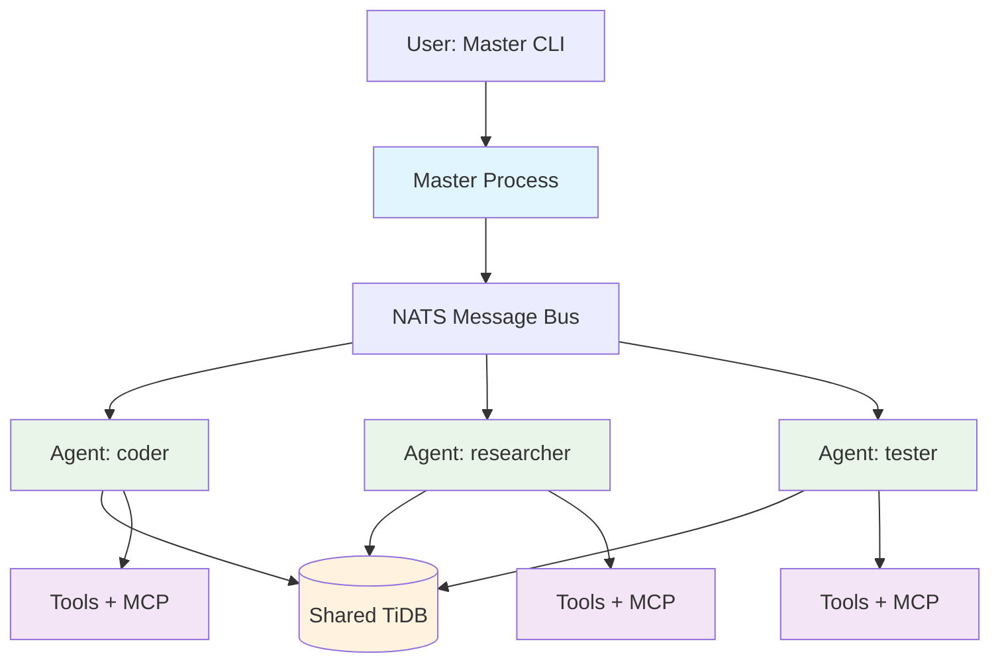
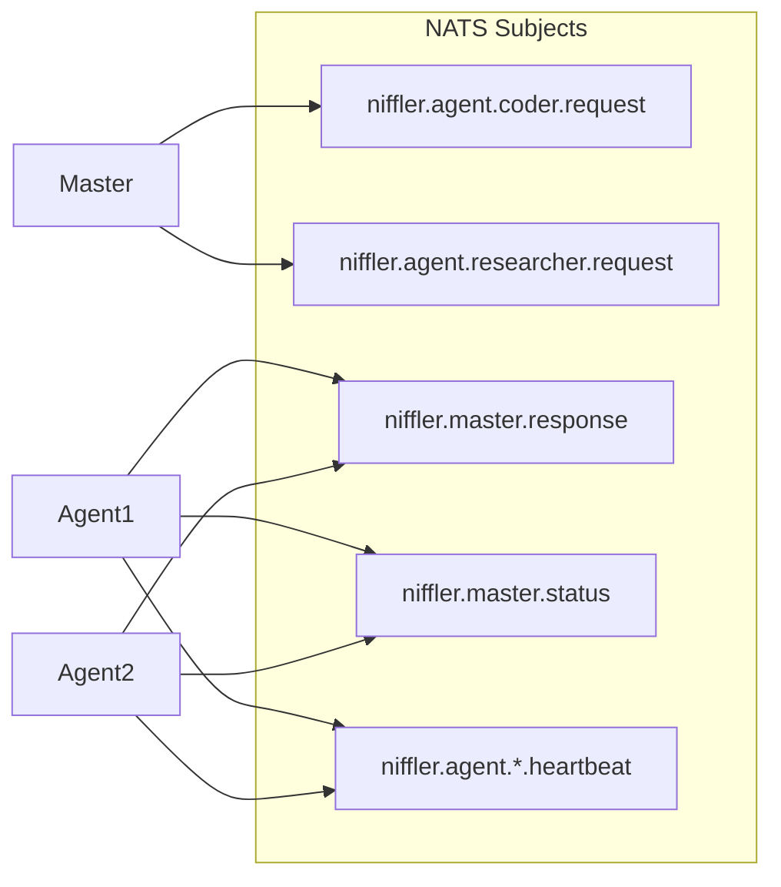
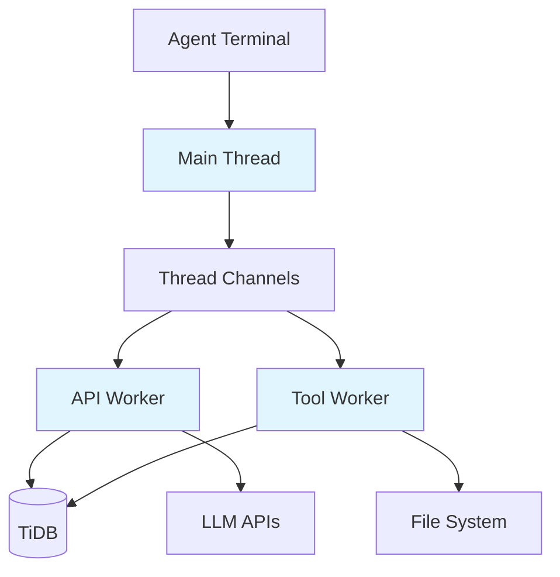
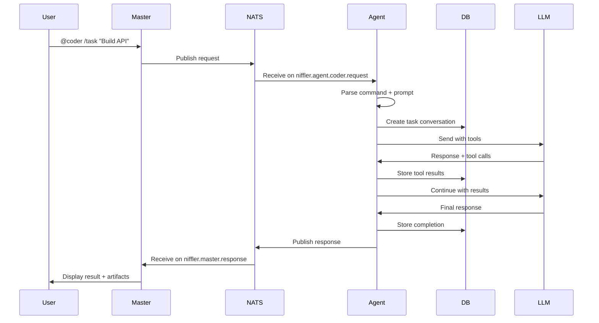

# Architecture & System Design

This document describes Niffler's distributed multi-agent architecture where specialized agents run as separate processes and collaborate via NATS messaging.

## Current Architecture: Distributed Multi-Agent

### Master-Worker Architecture with Chat Room Model

Niffler uses a distributed architecture with a master process orchestrating multiple specialized agent processes via NATS messaging:



**Architecture Components:**

1. **Master Process** (`./src/niffler`)
   - User-facing CLI with `@agent` routing syntax
   - NATS client for request/reply coordination
   - Agent discovery via presence tracking
   - Request routing and response aggregation

2. **Agent Processes** (`./src/niffler agent <name>`)
   - Specialized workers (coder, researcher, etc.)
   - Independent terminal per agent
   - Dedicated tool sets and permissions
   - Full conversation context per agent

3. **NATS Message Bus**
   - Inter-process communication backbone
   - Subject-based messaging (`niffler.agent.{name}.*`)
   - Request/reply pattern support
   - Presence tracking via JetStream KV
   - Chat room style collaboration

4. **Shared Resources**
   - TiDB database for persistent storage
   - Configuration in `~/.niffler/`
   - Agent definitions in markdown

### Chat Room Messaging Model

Agents communicate via NATS subjects using a publish-subscribe pattern:



**Message Flow:**
- Master publishes requests to `niffler.agent.{name}.request`
- Agents publish responses to `niffler.master.response`
- Agents publish status updates to `niffler.master.status`
- Heartbeats published to `niffler.agent.{name}.heartbeat`
- Wildcard subscriptions enable monitoring

### Agent Threading Model

Each agent process maintains the multi-threaded worker pattern:



**Per-Agent Threads:**
- **Main Thread**: Agent CLI and user interaction
- **API Worker**: LLM communication and streaming
- **Tool Worker**: Tool execution with validation
- **MCP Worker** (optional): External MCP server integration

### Communication Flow

**Request/Reply Pattern:**



**Key Characteristics:**
- Master is fire-and-forget to NATS
- Agents handle request lifecycle independently
- Asynchronous responses via NATS subscriptions
- Status updates during long-running tasks
- All state persisted to shared TiDB

## Design Principles

### 1. Process Isolation
**Rationale:**
- Fault isolation: crash in one agent doesn't affect others
- Per-agent resource management
- Independent tool permissions and security contexts
- Better debugging with separate terminals

**Implementation:**
- Each agent is a separate OS process
- Independent memory space and GC
- Process monitoring and restart capabilities
- Dedicated terminal per agent for visibility

### 2. Markdown-Based Agent Definitions
**Rationale:**
- User-extensible without code changes
- Version controllable agent configurations
- Easy to read and modify agent capabilities
- No compilation required for agent changes

**Structure:**
```
~/.niffler/default/agents/
├── coder.md          # Full tool access
├── researcher.md     # Read-only access
└── tester.md         # Test execution only
```

### 3. Chat Room Model
**Rationale:**
- Decoupled agents communicate via messages
- NATS provides reliable message delivery
- Subject-based routing for scalability
- Presence tracking for health monitoring

**Benefits:**
- Agents can be on same machine or distributed
- Easy to add new agents without reconfiguring others
- Fault tolerance through message persistence
- Observable communication patterns

### 4. Task vs Ask Semantics
**Rationale:**
- Clear distinction between isolated and continued work
- Task: Fresh context, no history pollution
- Ask: Multi-turn collaboration and refinement
- Consistent with industry patterns (Claude Code, etc.)

**Usage:**
```bash
# Task: Fresh context, immediate result
@coder /task "Create unit tests"

# Ask: Continue conversation
@coder "Refactor based on our discussion"
```

## System Components

### Master Process (`src/ui/master_cli.nim`)
**Responsibilities:**
- Parse `@agent` syntax from user input
- Route requests to appropriate agents
- Display responses and results
- Manage agent lifecycle
- Provide `/agents` command for discovery

**Key Features:**
- Input parsing with `parseAgentInput()`
- Agent availability checking
- Request/reply correlation via requestId
- Subscription management for responses

### Agent Process (`src/ui/agent_cli.nim`)
**Responsibilities:**
- Subscribe to NATS subject for requests
- Parse commands (/plan, /code, /task, /ask)
- Execute tasks with appropriate context
- Publish responses and status updates
- Send heartbeats for presence

**Key Features:**
- Command parser for agent operations
- Task executor with isolated context
- Tool permission enforcement
- Conversation management
- Heartbeat publishing

### NATS Client (`src/core/nats_client.nim`)
**Responsibilities:**
- Wrap `gokr/natswrapper` for Niffler's needs
- Connection management and reconnection
- Message publishing with subject routing
- Request/reply pattern implementation
- Presence tracking via JetStream KV

**Key Features:**
- Publish/subscribe primitives
- Request with timeout support
- Presence tracking (sendHeartbeat, isPresent)
- JetStream KV for durable state
- Connection pooling and management

## Message Types

### NatsRequest
```json
{
  "requestId": "uuid",
  "agentName": "coder",
  "input": "/task create a REST API"
}
```
- Agent parses commands from input string
- RequestId for correlation
- Agent routes based on agentName

### NatsResponse
```json
{
  "requestId": "uuid",
  "content": "API created successfully...",
  "done": false
}
```
- Streaming support via done flag
- Correlated via requestId
- Published to `niffler.master.response`

### NatsStatusUpdate
```json
{
  "requestId": "uuid",
  "agentName": "coder",
  "status": "Working on task..."
}
```
- Real-time status during execution
- Published to `niffler.master.status`

### NatsHeartbeat
```json
{
  "agentName": "coder",
  "timestamp": 1234567890
}
```
- Published every 5 seconds
- 15-second TTL for auto-expiration
- Stored in JetStream KV

## Data Persistence

### TiDB Database Schema

**Conversations Table:**
- `id` - Primary key
- `agent_id` - Which agent owns this conversation
- `type` - 'task' or 'ask'
- `status` - 'active', 'completed'
- `request_id` - Link to NATS request
- `parent_id` - For condensed conversations

**Messages Table:**
- `id` - Primary key
- `conversation_id` - Foreign key
- `role` - 'user', 'assistant', 'tool'
- `content` - Message text
- `tool_calls` - JSON array of tool calls
- `created_at` - Timestamp

**Agent State:**
- Current conversation per agent
- Tool execution history
- Token usage metrics
- Presence information

## Security Architecture

### Tool Execution Security
- Per-agent tool permissions
- Allowlist-based tool access
- Path sanitization prevents directory traversal
- Timeout enforcement prevents hanging
- Confirmation requirements for dangerous operations

### Inter-Process Security
- NATS authentication and TLS support
- Subject-based access control
- Message validation and sanitization
- No direct process communication (only via NATS)

## Scalability Considerations

### Current Scale
- Tested with 3-5 concurrent agents
- Each agent: ~50-100MB memory
- NATS handles message routing efficiently
- Database connection pooling shared

### Future Scaling
- Agents can run on different machines
- NATS clustering for distributed deployment
- Load balancing across agent pools
- Shared database enables horizontal scaling

## Performance Characteristics

### Latency
- NATS message delivery: <1ms on localhost
- Agent startup: 2-3 seconds (including model load)
- Request routing: 10-20ms overhead
- Tool execution: Same as single-process

### Throughput
- Multiple agents can work in parallel
- No global lock contention
- Independent tool execution per agent
- Database connection pooling optimized

## Monitoring and Observability

### Built-in Monitoring
- `/agents` command shows active agents
- Heartbeat tracking with timeout detection
- Status updates during task execution
- Error reporting via NATS

### Debugging
- Each agent has dedicated terminal output
- Separate log files per agent (optional)
- NATS message tracing capabilities
- Database query logging

## Future Enhancements

### Planned Features
- Agent auto-scaling based on load
- Inter-agent communication (agent-to-agent)
- Workflow orchestration across agents
- Agent health checks and recovery
- Resource limits per agent

### Research Areas
- Dynamic agent creation based on task type
- Agent specialization optimization
- Collaborative multi-agent problem solving
- Distributed context sharing

## Comparison: Single-Process vs Multi-Agent

| Aspect | Single-Process | Multi-Agent |
|--------|---------------|-------------|
| **Fault Isolation** | Process crash affects all | One agent crash doesn't affect others |
| **Visibility** | Single terminal | Per-agent terminal |
| **Tool Permissions** | Global | Per-agent configurable |
| **Resource Usage** | Lower memory | Higher memory (per process) |
| **Scalability** | Vertical only | Horizontal scaling possible |
| **Complexity** | Simpler | More complex (NATS, process mgmt) |
| **Use Case** | Single user | Multi-agent collaboration |

## Conclusion

Niffler's distributed multi-agent architecture provides:
- **Specialization**: Different agents for different tasks
- **Isolation**: Fault boundaries between agents
- **Visibility**: Per-agent terminal output
- **Scalability**: Foundation for distributed deployment
- **Flexibility**: Easy to add new agent types

The chat room model via NATS enables clean decoupling while maintaining the collaborative feel of a team of AI assistants working together.

---

**Last Updated:** 2025-12-02
**Architecture Version:** 0.4.0 (Multi-Agent)
**Related Docs:** [TASK.md](TASK.md) (Multi-agent details), [DEVELOPMENT.md](DEVELOPMENT.md) (Implementation)
