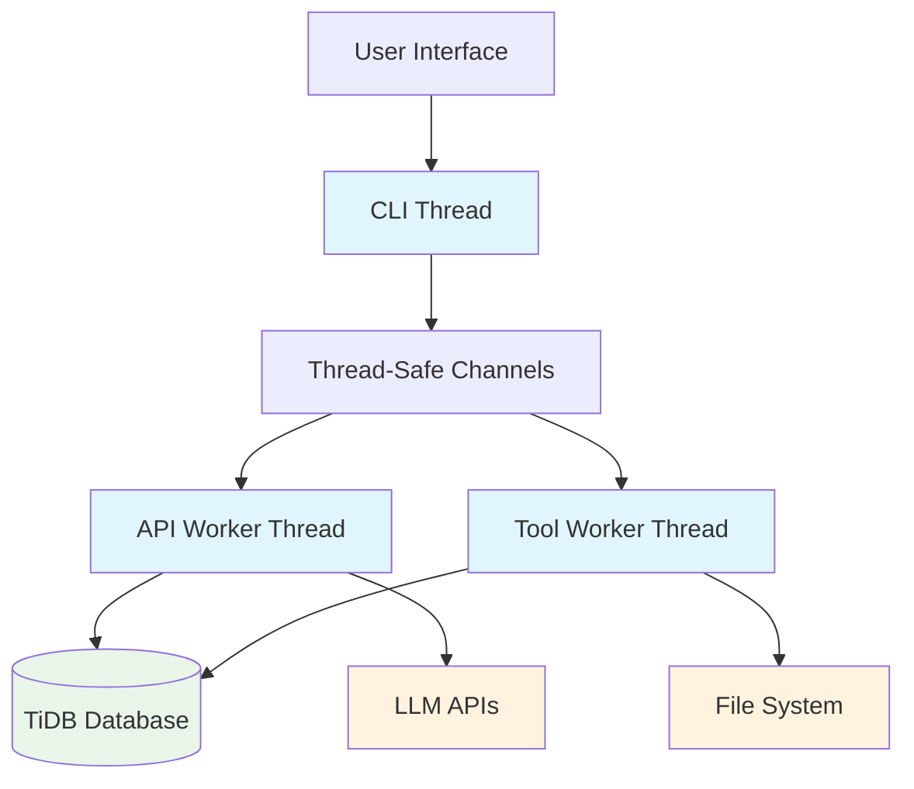
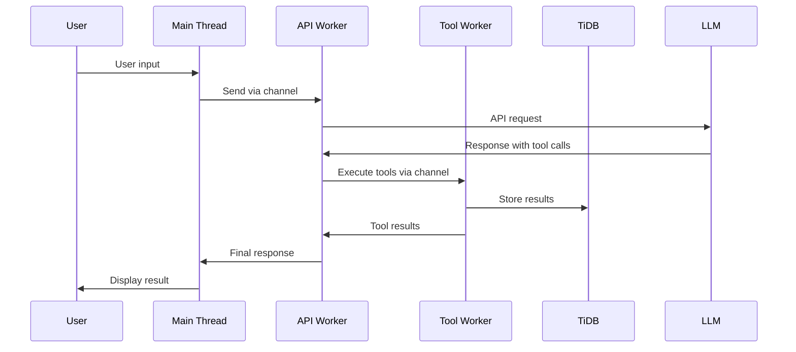
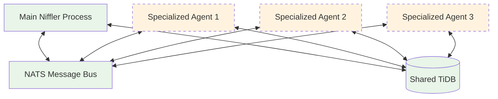

# Architecture & System Design

This document describes Niffler's current architecture and planned multi-agent features.

## Current Architecture

### Single-Process Multi-Threaded Design

Niffler currently runs as a single process with a multi-threaded architecture:

### Threading Model

- **Main Thread**: Handles CLI interaction and user input
- **API Worker Thread**: Manages LLM API communication and streaming responses
- **Tool Worker Thread**: Executes tool operations with validation and security
- **Thread-Safe Channels**: Coordinate communication between threads using Nim channels

### Communication Flow

## Planned Multi-Agent Architecture

Niffler has the foundation for a distributed multi-agent system using NATS messaging, but this is not yet implemented. The planned design includes:

### Architecture Components in Development

- **NATS Client Infrastructure**: Basic NATS connectivity exists in `src/core/nats_client.nim`
- **Agent Type System**: Agent definitions and validation framework
- **Multi-Process Communication**: Message passing infrastructure for inter-process communication

### Future Multi-Agent Design (Planned)

## Key Architectural Benefits (Current)

### Thread Safety & Isolation
- Each worker thread operates independently with clear separation of concerns
- Thread-safe channels prevent race conditions and data corruption
- Tool execution is isolated from API communication

### Performance & Responsiveness
- Non-blocking UI with dedicated worker threads
- Parallel API and tool execution capabilities
- Efficient message passing between components

### Extensibility
- Plug-in tool system via registry pattern
- Modular architecture makes adding new features straightforward
- Foundation ready for multi-agent expansion

## Data Persistence

### TiDB Database
- **Configuration**: See `~/.niffler/config.yaml` for database connection settings
- **Purpose**: Persistent storage for conversations, messages, and token usage
- **Thread Safety**: Connection pooling ensures safe access across threads
- **Scalability**: TiDB provides distributed, MySQL-compatible storage

### Key Tables
- `conversation`: Conversation metadata and settings
- `conversation_message`: Individual messages in conversations
- `model_token_usage`: Token usage and cost tracking per API call
- `conversation_thinking_token`: Reasoning token storage

## Configuration System

### YAML-Based Configuration
- **Location**: `~/.niffler/config.yaml`
- **Features**: Model definitions, tool permissions, system settings
- **Validation**: Schema-based configuration validation
- **Hot Reloading**: Configuration changes apply without restart (where applicable)

## Security Architecture

### Tool Execution Security
- Path sanitization prevents directory traversal attacks
- Timeout enforcement prevents hanging operations
- Confirmation requirements for dangerous operations
- Permission-based tool access control

### API Security
- Environment-variable based API key management
- Secure HTTP client with proper certificate validation
- Token usage tracking and cost monitoring

## Future Development Plans

The current architecture provides a solid foundation for the planned distributed multi-agent system. The NATS infrastructure and agent type system are in place for future development. For now, Niffler operates as an efficient single-process, multi-threaded application that can be easily extended to multi-agent operation when needed.