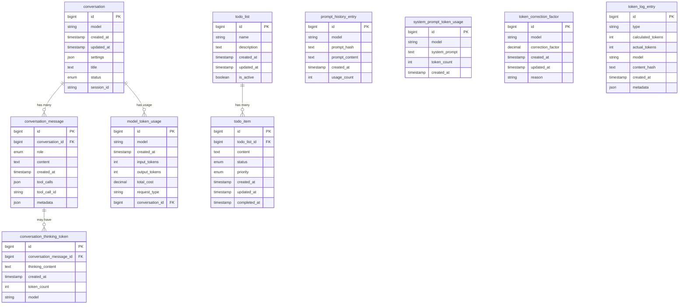

# Database Schema Documentation

## Overview

Niffler uses TiDB (MySQL-compatible) for persistent storage of conversations, messages, token usage, and task data. The schema is designed to support multi-agent architectures, conversation tracking, cost monitoring, and persistence of AI reasoning processes.

## ERD Diagram



## Table Details

### Core Conversation Tables

#### `conversation`

Stores conversation metadata and state.

| Column | Type | Description |
|--------|------|-------------|
| `id` | bigint | Primary key, auto-incrementing |
| `model` | varchar(255) | AI model used for this conversation |
| `created_at` | timestamp | When conversation was created |
| `updated_at` | timestamp | Last activity timestamp |
| `settings` | json | Conversation-specific settings and configuration |
| `title` | text | Human-readable conversation title |
| `status` | enum | Conversation status (active, archived, deleted) |
| `session_id` | varchar(255) | Unique session identifier |

**Indexes:**
- PRIMARY KEY (`id`)
- INDEX `idx_conversation_session` (`session_id`)
- INDEX `idx_conversation_model` (`model`)
- INDEX `idx_conversation_created` (`created_at`)

#### `conversation_message`

Stores individual messages within conversations.

| Column | Type | Description |
|--------|------|-------------|
| `id` | bigint | Primary key, auto-incrementing |
| `conversation_id` | bigint | Foreign key to conversation.id |
| `role` | enum | Message role (user, assistant, system, tool) |
| `content` | longtext | Message content |
| `created_at` | timestamp | When message was created |
| `tool_calls` | json | Tool calls made by assistant (if any) |
| `tool_call_id` | varchar(255) | Tool call identifier for response matching |
| `metadata` | json | Additional message metadata |

**Indexes:**
- PRIMARY KEY (`id`)
- FOREIGN KEY (`conversation_id`) → `conversation.id`
- INDEX `idx_message_conversation` (`conversation_id`)
- INDEX `idx_message_created` (`created_at`)
- INDEX `idx_message_tool_call` (`tool_call_id`)

### Token Usage and Monitoring

#### `model_token_usage`

Tracks token usage and costs per API call.

| Column | Type | Description |
|--------|------|-------------|
| `id` | bigint | Primary key, auto-incrementing |
| `model` | varchar(255) | AI model used |
| `created_at` | timestamp | When the API call was made |
| `input_tokens` | int | Number of input tokens used |
| `output_tokens` | int | Number of output tokens generated |
| `total_cost` | decimal(10,6) | Total cost in USD |
| `request_type` | varchar(100) | Type of request (completion, embedding, etc.) |
| `conversation_id` | bigint | Foreign key to conversation.id |

**Indexes:**
- PRIMARY KEY (`id`)
- FOREIGN KEY (`conversation_id`) → `conversation.id`
- INDEX `idx_usage_model` (`model`)
- INDEX `idx_usage_created` (`created_at`)

#### `conversation_thinking_token`

Stores reasoning/thinking tokens from models that support them.

| Column | Type | Description |
|--------|------|-------------|
| `id` | bigint | Primary key, auto-incrementing |
| `conversation_message_id` | bigint | Foreign key to conversation_message.id |
| `thinking_content` | longtext | Raw thinking content |
| `created_at` | timestamp | When thinking was generated |
| `token_count` | int | Number of thinking tokens |
| `model` | varchar(255) | Model that generated thinking |

**Indexes:**
- PRIMARY KEY (`id`)
- FOREIGN KEY (`conversation_message_id`) → `conversation_message.id`
- INDEX `idx_thinking_message` (`conversation_message_id`)

### Token Analysis and Debugging

#### `token_correction_factor`

Stores correction factors for token counting accuracy.

| Column | Type | Description |
|--------|------|-------------|
| `id` | bigint | Primary key, auto-incrementing |
| `model` | varchar(255) | Model this correction applies to |
| `correction_factor` | decimal(5,4) | Multiplier for adjusting token counts |
| `created_at` | timestamp | When correction was established |
| `updated_at` | timestamp | Last updated timestamp |
| `reason` | text | Why this correction was needed |

**Indexes:**
- PRIMARY KEY (`id`)
- UNIQUE INDEX `idx_correction_model` (`model`)
- INDEX `idx_correction_created` (`created_at`)

#### `token_log_entry`

Detailed logging for token counting analysis.

| Column | Type | Description |
|--------|------|-------------|
| `id` | bigint | Primary key, auto-incrementing |
| `type` | varchar(50) | Entry type (calculation, api_response, correction) |
| `calculated_tokens` | int | Tokens calculated locally |
| `actual_tokens` | int | Tokens reported by API |
| `model` | varchar(255) | Model involved |
| `content_hash` | varchar(64) | Hash of content for deduplication |
| `created_at` | timestamp | When entry was created |
| `metadata` | json | Additional debugging information |

**Indexes:**
- PRIMARY KEY (`id`)
- INDEX `idx_token_log_model` (`model`)
- INDEX `idx_token_log_type` (`type`)
- INDEX `idx_token_log_hash` (`content_hash`)

#### `system_prompt_token_usage`

Tracks system prompt token usage across conversations.

| Column | Type | Description |
|--------|------|-------------|
| `id` | bigint | Primary key, auto-incrementing |
| `model` | varchar(255) | Model used |
| `system_prompt` | text | The system prompt content |
| `token_count` | int | Number of tokens in system prompt |
| `created_at` | timestamp | When recorded |

**Indexes:**
- PRIMARY KEY (`id`)
- INDEX `idx_system_prompt_model` (`model`)

### Todo System

#### `todo_list`

Container for todo items.

| Column | Type | Description |
|--------|------|-------------|
| `id` | bigint | Primary key, auto-incrementing |
| `name` | varchar(255) | Name of the todo list |
| `description` | text | Optional description |
| `created_at` | timestamp | When list was created |
| `updated_at` | timestamp | Last update timestamp |
| `is_active` | boolean | Whether this list is currently active |

**Indexes:**
- PRIMARY KEY (`id`)
- INDEX `idx_todo_list_active` (`is_active`)

#### `todo_item`

Individual todo items within lists.

| Column | Type | Description |
|--------|------|-------------|
| `id` | bigint | Primary key, auto-incrementing |
| `todo_list_id` | bigint | Foreign key to todo_list.id |
| `content` | text | Todo item content |
| `status` | enum | Item status (pending, in_progress, completed, cancelled) |
| `priority` | enum | Priority level (low, medium, high) |
| `created_at` | timestamp | When item was created |
| `updated_at` | timestamp | Last update timestamp |
| `completed_at` | timestamp | When item was completed (if applicable) |

**Indexes:**
- PRIMARY KEY (`id`)
- FOREIGN KEY (`todo_list_id`) → `todo_list.id`
- INDEX `idx_todo_item_status` (`status`)
- INDEX `idx_todo_item_priority` (`priority`)
- INDEX `idx_todo_item_list` (`todo_list_id`)

### Prompt History and Caching

#### `prompt_history_entry`

Tracks prompt usage for optimization and analysis.

| Column | Type | Description |
|--------|------|-------------|
| `id` | bigint | Primary key, auto-incrementing |
| `model` | varchar(255) | Model this prompt was used with |
| `prompt_hash` | varchar(64) | SHA-256 hash of prompt content |
| `prompt_content` | longtext | The actual prompt content |
| `created_at` | timestamp | First use of this prompt |
| `usage_count` | int | How many times this prompt been used |

**Indexes:**
- PRIMARY KEY (`id`)
- UNIQUE INDEX `idx_prompt_hash` (`prompt_hash`)
- INDEX `idx_prompt_model` (`model`)
- INDEX `idx_prompt_usage` (`usage_count` DESC)

## Migration Notes

### From Earlier Versions

If migrating from an earlier version of Niffler:

1. **SQLite to TiDB Migration**: The current schema assumes TiDB/MySQL. When migrating from SQLite:
   - Update VARCHAR size limits (SQLite has no practical limit)
   - Convert SQLite-specific types (TEXT should become LONGTEXT for large content)
   - Add proper foreign key constraints

2. **Column Additions**: Recent additions:
   - `thinking_token` tables for Claude-style reasoning
   - Token correction and logging for debugging
   - Enhanced metadata for messages and usage

### Index Optimization

For production use, consider additional indexes based on query patterns:

```sql
-- For conversation time-series analysis
CREATE INDEX idx_conversation_daily ON conversation (DATE(created_at));

-- For expensive conversation tracking
CREATE INDEX idx_usage_cost_desc ON model_token_usage (total_cost DESC, created_at DESC);

-- For todo completion analytics
CREATE INDEX idx_todo_completion ON todo_item (completed_at, status);
```

## Performance Considerations

1. **Token Usage Tables**: Can grow rapidly. implement periodic archiving for entries older than 30 days.
2. **Message Content**: Use compression for large message content if storage becomes an issue.
3. **Thinking Tokens**: These can be very large, consider separate archival strategy.
4. **Prompt History**: Implement cleanup for unused prompts (usage_count = 1, older than 90 days).

## Backup and Recovery

### Critical Tables to Backup

All tables are important, but prioritize:
1. `conversation` and `conversation_message` - Core conversation data
2. `todo_item` and `todo_list` - User task data
3. `model_token_usage` - Cost tracking data

### Recovery Procedures

```bash
# Full backup
mysqldump -h 127.0.0.1 -P 4000 -u root niffler > niffler_full_$(date +%Y%m%d).sql

# Conversation-only backup
mysqldump -h 127.0.0.1 -P 4000 -u root niffler conversation conversation_message > niffler_conv_$(date +%Y%m%d).sql

# Restore (use with caution)
mysql -h 127.0.0.1 -P 4000 -u root niffler < niffler_full_20241201.sql
```

## Query Examples

### Get Conversation Cost Summary

```sql
SELECT
    c.id,
    c.title,
    c.created_at,
    SUM(mtu.input_tokens) as total_input,
    SUM(mtu.output_tokens) as total_output,
    SUM(mtu.total_cost) as total_cost
FROM conversation c
LEFT JOIN model_token_usage mtu ON c.id = mtu.conversation_id
GROUP BY c.id, c.title, c.created_at
ORDER BY total_cost DESC;
```

### Top Expensive Conversations

```sql
SELECT
    DATE(mtu.created_at) as date,
    mtu.model,
    SUM(mtu.total_cost) as daily_cost,
    COUNT(DISTINCT mtu.conversation_id) as conversations
FROM model_token_usage mtu
WHERE mtu.created_at >= DATE_SUB(NOW(), INTERVAL 30 DAY)
GROUP BY DATE(mtu.created_at), mtu.model
ORDER BY daily_cost DESC;
```

### Todo Completion Analytics

```sql
SELECT
    DATE(completed_at) as date,
    priority,
    COUNT(*) as completed_count
FROM todo_item
 WHERE status = 'completed'
   AND completed_at >= DATE_SUB(NOW(), INTERVAL 7 DAY)
GROUP BY DATE(completed_at), priority
ORDER BY date DESC;
```

## Security Considerations

1. **PII in Conversations**: Messages may contain sensitive information. Apply proper access controls.
2. **API Keys**: Never store API keys in the database - keep encrypted in config files.
3. **Content Hashing**: Consider encrypting sensitive prompt content if logging full prompts.
4. **Access Control**: Use database-level permissions to restrict access to sensitive tables.

## Monitoring and Maintenance

### Queries for Health Monitoring

```sql
-- Database size monitoring
SELECT
    table_name,
    ROUND(((data_length + index_length) / 1024 / 1024), 2) AS 'Size (MB)'
FROM information_schema.tables
WHERE table_schema = 'niffler'
ORDER BY (data_length + index_length) DESC;

-- Conversation growth rate
SELECT
    DATE(created_at) as date,
    COUNT(*) as conversations
FROM conversation
WHERE created_at >= DATE_SUB(NOW(), INTERVAL 30 DAY)
GROUP BY DATE(created_at)
ORDER BY date DESC;

-- Token usage trends
SELECT
    DATE(created_at) as date,
    SUM(input_tokens + output_tokens) as total_tokens,
    SUM(total_cost) as total_cost
FROM model_token_usage
WHERE created_at >= DATE_SUB(NOW(), INTERVAL 7 DAY)
GROUP BY DATE(created_at)
ORDER BY date DESC;
```

For ongoing database health, set up monitoring for:
- Table growth rates
- Query performance (slow query log)
- Connection pool usage
- Backup completion status