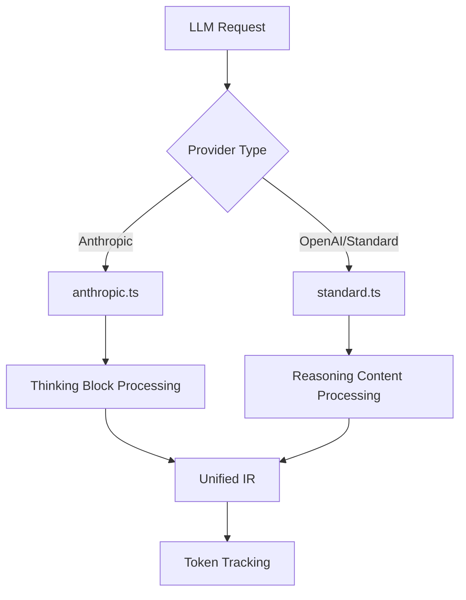

# How Octofriend Handles Thinking Tokens

Based on my analysis of the Octofriend codebase, I can now provide a comprehensive explanation of how it handles "thinking tokens". Here's how Octofriend carefully manages thinking tokens to ensure it's always as smart as it can be:

## How Octofriend Handles Thinking Tokens

Octofriend implements a sophisticated system for managing thinking tokens across different LLM providers, particularly for advanced models like GPT-5 and Claude 4 that may have encrypted or special reasoning content.

### 1. **Multi-Provider Support Architecture**

Octofriend supports thinking tokens across different LLM providers through specialized compiler modules:



### 2. **Anthropic-Specific Thinking Token Handling**

In `source/compilers/anthropic.ts`, Octofriend implements sophisticated handling of Anthropic's thinking blocks:

#### **Thinking Block Schema and Processing**
The system processes streaming thinking content through several key mechanisms:

1. **Budget Configuration**: Models can be configured with different reasoning levels (low: 2048 tokens, medium: 4096 tokens, high: 8192 tokens)

2. **Streaming Processing**: Real-time handling of thinking tokens with proper indexing and signature management

3. **Encrypted Content Support**: Handles redacted thinking blocks for encrypted content through the `redacted_thinking` type

### 3. **OpenAI/Standard Provider Reasoning Support**

In `source/compilers/standard.ts`, Octofriend handles OpenAI-style reasoning content through a dual approach:

1. **XML Tag Parsing**: Uses a streaming XML parser for `<think>` tags
2. **Native reasoning_content**: Supports OpenAI's native reasoning content field

### 4. **Unified Intermediate Representation (IR)**

The system uses a sophisticated IR system in `source/ir/llm-ir.ts` to normalize thinking token handling across providers:

#### **Assistant Message Structure**
```typescript
export type AssistantMessage = {
  role: "assistant",
  content: string,
  reasoningContent?: string | null,
  openai?: {
    encryptedReasoningContent?: string | null,
    reasoningId?: string,
  },
  anthropic?: AnthropicAssistantData,
  toolCall?: ToolCallRequest,
  tokenUsage: number;
};
```

This unified structure allows Octofriend to:
- Store reasoning content separately from regular content
- Handle both encrypted and unencrypted thinking tokens
- Maintain provider-specific metadata while providing a consistent interface

### 5. **Token Tracking and Budget Management**

Octofriend implements comprehensive token tracking in `source/token-tracker.ts` and intelligent context window management in `source/ir/ir-windowing.ts` that preserves thinking tokens while managing context limits.

### 6. **Configuration-Based Reasoning Levels**

In `source/config.ts`, users can configure reasoning levels that map to different token budgets, allowing fine-tuned control over how much thinking capacity each model has.

### 7. **Key Innovations in Thinking Token Management**

#### **1. Streaming Processing**
- Real-time handling of thinking tokens as they arrive
- Separate callbacks for reasoning vs. regular content
- Proper indexing and ordering of thinking blocks

#### **2. Encryption-Aware Architecture**
- Support for both clear-text and encrypted thinking content
- Redacted thinking block handling for privacy-preserving models
- Maintains reasoning context even when content is encrypted

#### **3. Provider Abstraction**
- Unified interface across different LLM providers
- Preserves provider-specific features while maintaining consistency
- Seamless switching between models with different thinking token formats

#### **4. Token Budget Optimization**
- Dynamic adjustment of max_tokens based on thinking budget
- Intelligent context windowing that preserves important reasoning
- Precise token tracking for cost management

### 8. **Why This Makes Octofriend "Smarter"**

The sophisticated thinking token management provides several key advantages:

1. **Preserved Reasoning Context**: By properly handling thinking tokens, Octofriend maintains the model's reasoning chain across multiple turns, leading to more coherent and contextually aware responses.

2. **Multi-Turn Intelligence**: The system can reference previous thinking processes, allowing for more complex multi-step reasoning and problem-solving.

3. **Provider Flexibility**: Users can switch between different LLM providers (Anthropic, OpenAI, etc.) without losing the benefits of thinking token processing.

4. **Encrypted Content Support**: Octofriend can work with next-generation models that may encrypt their thinking processes, maintaining functionality even when content is not directly readable.

5. **Optimized Token Usage**: Intelligent budget management ensures that thinking tokens don't overwhelm the context window while preserving their value for reasoning.

This comprehensive approach to thinking token management is what makes Octofriend particularly effective with advanced reasoning models like GPT-5 and Claude 4, as it can properly handle, preserve, and utilize the model's internal reasoning process across multiple interactions.