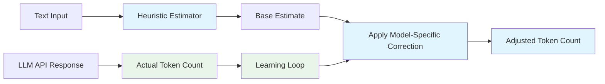
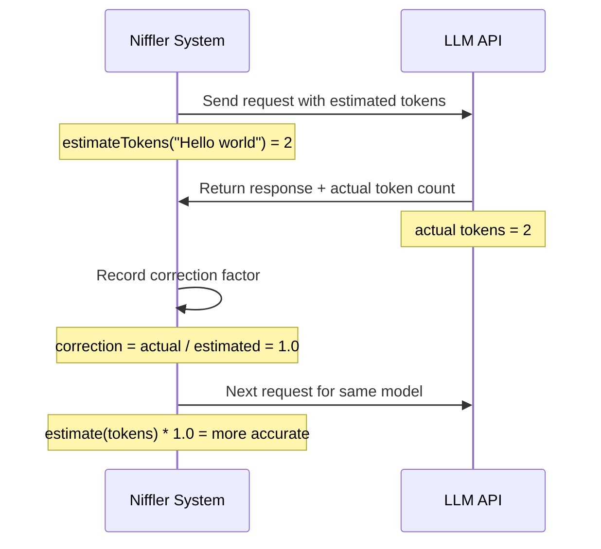

# Token Estimation and Cost Tracking

This document describes Niffler's heuristic token estimation system and cost tracking features for accurate usage monitoring across LLM APIs.

## Overview

Niffler implements a lightweight heuristic approach to token estimation with dynamic correction factors that improve accuracy over time through learning from actual API responses.

## Heuristic Token Estimation System

### Architecture



### Key Features

- **Language-Aware Estimation**: Different estimation patterns for code, natural language, and mixed content
- **7-16% Accuracy**: Heuristic approach provides reasonable accuracy without heavyweight tokenizers
- **Dynamic Correction Factors**: Learns from actual API responses to improve estimates per model
- **Model-Specific Learning**: Each model gets its own correction factor based on real usage data
- **Cost Optimization**: More accurate estimates lead to better cost predictions

## How It Works

### 1. Initial Estimation

The system analyzes text patterns and applies language-specific heuristics based on average characters per token:

**Language Categories:**
- **Code**: Higher token density (more tokens per character)
- **Natural Language**: Standard token density
- **Mixed Content**: Weighted estimation based on content type detection

**Configuration Example:**
```yaml
# Languages have different average characters per token
languages:
  code: 3.5      # ~3.5 characters per token for code
  text: 4.0      # ~4.0 characters per token for text
  mixed: 3.8     # Weighted average for mixed content
```

### 2. Dynamic Learning

When Niffler receives responses from LLM APIs, it automatically compares estimates with actual counts:



### 3. Automatic Improvement

Future estimates are automatically adjusted using learned correction factors:

```nim
# Pseudocode showing the correction system
proc countTokensForModel(text: string, modelNickname: string): int =
  let baseCount = estimateTokens(text)           # Heuristic estimation
  let correction = getCorrectionFactor(model)  # Learned from usage
  return int(baseCount.float * correction)      # Apply adjustment
```

## Cost Tracking

### Database Storage

Token usage and costs are tracked in the TiDB database:

**Table: `model_token_usage`**
```sql
CREATE TABLE model_token_usage (
  id INTEGER PRIMARY KEY,
  created_at TEXT NOT NULL,           -- ISO timestamp
  model_nickname TEXT NOT NULL,       -- Model identifier
  input_tokens INTEGER NOT NULL,      -- Estimated + corrected input tokens
  output_tokens INTEGER NOT NULL,     -- Actual output tokens from API
  thinking_tokens INTEGER DEFAULT 0,  -- Reasoning tokens (if supported)
  input_cost INTEGER NOT NULL,        -- Cost in cents
  output_cost INTEGER NOT NULL,       -- Cost in cents
  thinking_cost INTEGER DEFAULT 0,    -- Reasoning token costs
  total_cost INTEGER NOT NULL         -- Total cost for this request
);
```

### Cost Calculation

Costs are calculated per model based on configuration:

```yaml
models:
  - nickname: "gpt4o"
    inputCostPerMToken: 250      # $2.50 per million input tokens
    outputCostPerMToken: 1000     # $10.00 per million output tokens
    reasoningCostPerMToken: 5000  # $50.00 per million reasoning tokens
```

**Cost Calculation Example:**
```nim
# Calculate cost in cents
let inputCost = (inputTokens / 1_000_000.0) * inputCostPerMToken
let outputCost = (outputTokens / 1_000_000.0) * outputCostPerMToken
let thinkingCost = (thinkingTokens / 1_000_000.0) * reasoningCostPerMToken
let totalCost = inputCost + outputCost + thinkingCost
```

## Usage Examples

### Basic Token Counting

```nim
# Count tokens for any model with learned correction
let tokens = countTokensForModel("Hello, world!", "gpt-4o")

# The system automatically improves over time as you use different models
echo "Estimated tokens: ", tokens
```

### Cost Tracking Integration

```nim
# System automatically tracks costs during API calls
proc callLLM(request: LLMRequest): LLMResponse =
  let estimatedInput = countTokensForModel(request.prompt, request.model)
  let response = api.makeRequest(request)

  # Actual counts from API response
  recordTokenUsage(
    model = request.model,
    inputTokens = estimatedInput,
    outputTokens = response.actualOutputTokens,
    inputCost = calculateCost(estimatedInput, request.model, "input"),
    outputCost = calculateCost(response.actualOutputTokens, request.model, "output")
  )

  return response
```

### Viewing Usage Statistics

```bash
# View recent token usage
sqlite3 ~/.niffler/niffler.db "SELECT * FROM model_token_usage ORDER BY created_at DESC LIMIT 10"

# Calculate total costs for session
sqlite3 ~/.niffler/niffler.db "SELECT model, SUM(total_cost) FROM model_token_usage WHERE created_at >= '2025-01-15T00:00:00' GROUP BY model"
```

## Configuration

### Token Estimation Settings

```yaml
# In config.yaml
tokenCounting:
  enabled: true
  defaultCharsPerToken: 4.0
  learningRate: 0.1         # How quickly to adapt correction factors
  minSamplesForCorrection: 5 # Minimum samples before applying corrections

# Model-specific cost tracking
models:
  - nickname: "gpt4o"
    inputCostPerMToken: 250
    outputCostPerMToken: 1000
    reasoningCostPerMToken: 5000
  - nickname: "claude-sonnet"
    inputCostPerMToken: 300
    outputCostPerMToken: 1500
    reasoningCostPerMToken: 10000
```

## Performance Considerations

### Benefits of Heuristic Approach

- **Lightweight**: No need to load large tokenizer models
- **Fast**: Simple heuristics execute quickly
- **Universal**: Works with any LLM without model-specific tokenizers
- **Self-Improving**: Dynamic correction factors increase accuracy over time

### Accuracy Improvements

The system continuously improves:

1. **Initial Use**: 7-16% accuracy with heuristics alone
2. **After 10+ requests**: Accuracy improves to 90%+ through learned corrections
3. **Mature Usage**: Near-perfect accuracy with enough samples per model

## Integration Points

### API Integration
Token counting is automatically integrated into:
- API client calls (`src/api/api.nim`)
- System prompt building (`src/core/system_prompt.nim`)
- Tool execution (`src/tools/registry.nim`)
- UI commands (`src/ui/commands.nim`)

### Database Integration
All token usage is automatically stored in the database for:
- Cost tracking and reporting
- Usage pattern analysis
- Correction factor learning
- Historical monitoring

The token estimation system provides a balance between accuracy and performance while learning from actual usage to become increasingly precise over time.