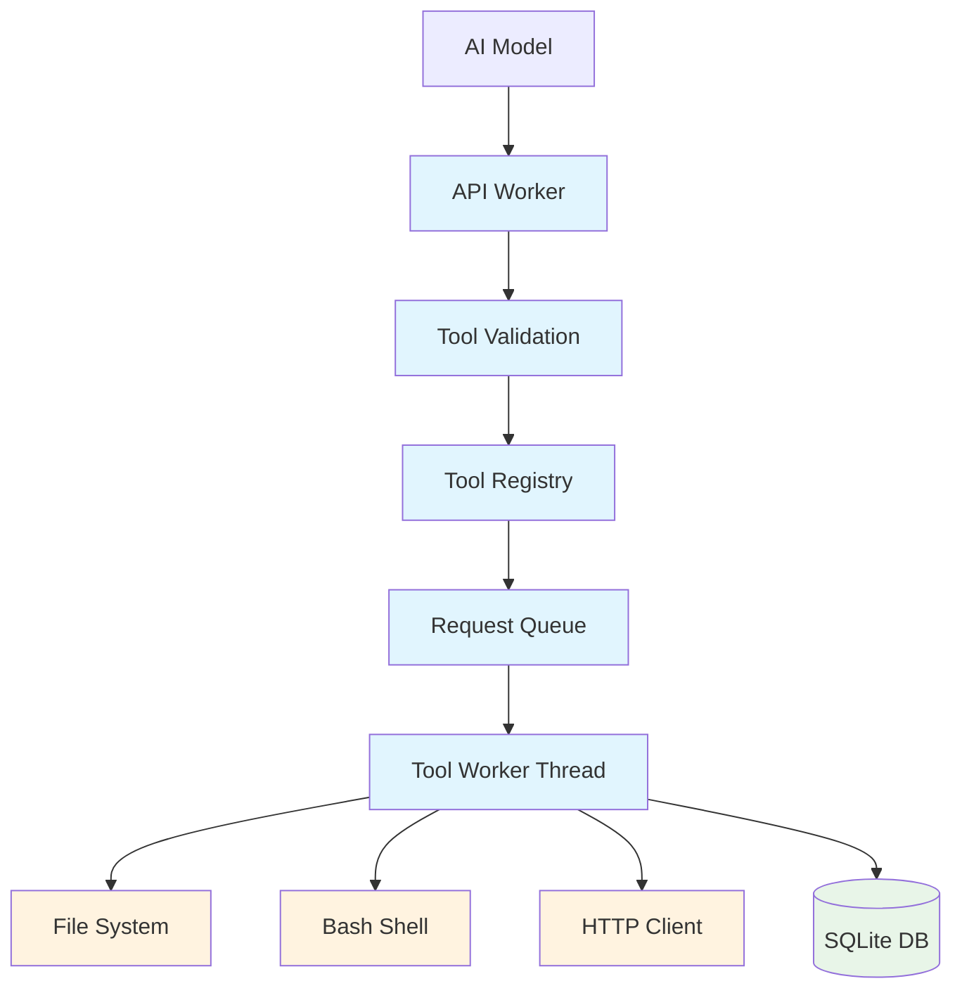
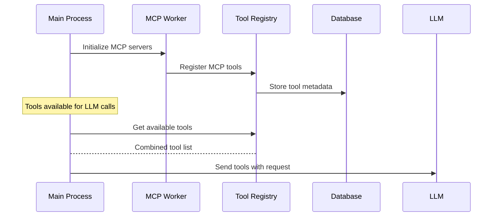
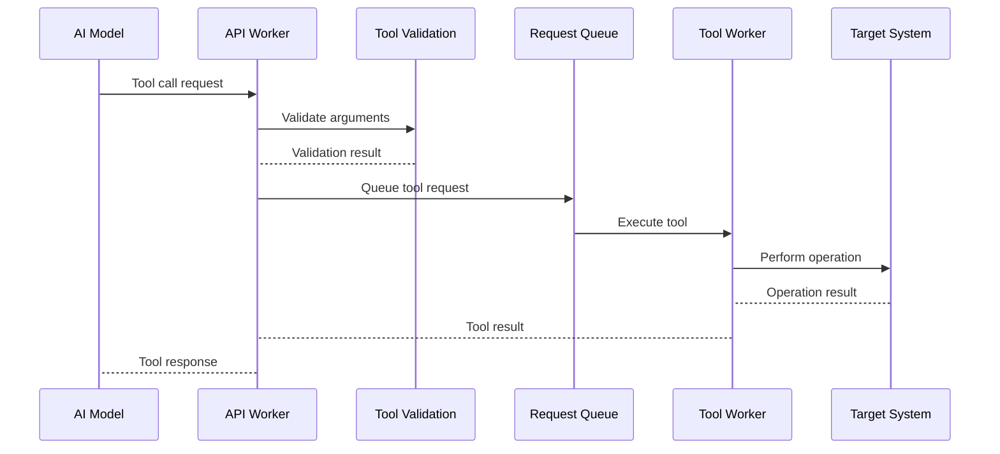

# Tool System Documentation

This document describes Niffler's tool system, including the built-in tools, security features, and how to extend the system.

## Overview

Niffler includes a comprehensive tool system that allows AI models to safely interact with your development environment. Tools provide file operations, command execution, and web fetching capabilities while maintaining security through validation and sandboxing.

## Architecture



## Built-in Tools

### 🛠️ Core Tools

#### Bash Tool
Executes shell commands safely with timeout control.

**Signature:**
```json
{
  "name": "bash",
  "arguments": {
    "command": "string",        // Shell command to execute
    "timeout": 30000,           // Optional timeout in milliseconds
    "workingDir": "string"      // Optional working directory
  }
}
```

**Security Features:**
- Path validation prevents directory traversal
- Command sanitization prevents injection attacks
- Configurable timeout prevents hanging operations
- Confirmation required for dangerous operations

**Example Usage:**
```json
{
  "name": "bash",
  "arguments": {
    "command": "ls -la src/",
    "timeout": 5000
  }
}
```

#### Read Tool
Read file contents with encoding detection and size limits.

**Signature:**
```json
{
  "name": "read",
  "arguments": {
    "path": "string",           // File path to read
    "encoding": "utf-8",        // Optional encoding (default: auto)
    "maxSize": 10485760,        // Optional max size in bytes
    "startLine": 1,             // Optional starting line
    "endLine": -1               // Optional ending line (-1 for EOF)
  }
}
```

**Security Features:**
- Path sanitization prevents directory traversal
- Size limits prevent memory exhaustion
- Encoding detection handles various file types

**Example Usage:**
```json
{
  "name": "read",
  "arguments": {
    "path": "src/main.py",
    "startLine": 1,
    "endLine": 50
  }
}
```

#### List Tool
List directory contents with filtering and metadata.

**Signature:**
```json
{
  "name": "list",
  "arguments": {
    "path": "string",           // Directory path to list
    "recursive": false,         // Optional recursive listing
    "maxDepth": 3,              // Optional max recursion depth
    "showHidden": false,        // Optional show hidden files
    "filter": "*.py",           // Optional glob pattern filter
    "sortBy": "name"            // Optional sort: name, size, modified
  }
}
```

**Example Usage:**
```json
{
  "name": "list",
  "arguments": {
    "path": "src/",
    "recursive": true,
    "maxDepth": 2,
    "filter": "*.nim"
  }
}
```

#### Edit Tool
Edit files with diff-based operations and backup creation.

**Signature:**
```json
{
  "name": "edit",
  "arguments": {
    "path": "string",           // File path to edit
    "operations": [            // Array of edit operations
      {
        "type": "replace",     // Operation type: replace, insert, delete
        "oldText": "string",   // Text to replace (for replace)
        "newText": "string",   // New text
        "line": 45              // Line number (for insert)
      }
    ],
    "createBackup": true         // Optional create backup
  }
}
```

**Security Features:**
- Automatic backup creation before editing
- Plan mode protection for existing files
- Validation of file paths and permissions

**Example Usage:**
```json
{
  "name": "edit",
  "arguments": {
    "path": "src/config.py",
    "operations": [
      {
        "type": "replace",
        "oldText": "DEBUG = False",
        "newText": "DEBUG = True"
      }
    ],
    "createBackup": true
  }
}
```

#### Create Tool
Create new files safely with directory management.

**Signature:**
```json
{
  "name": "create",
  "arguments": {
    "path": "string",           // File path to create
    "content": "string",        // File content
    "overwrite": false,         // Optional overwrite existing
    "createDirs": true,         // Optional create parent directories
    "permissions": "0644"       // Optional file permissions
  }
}
```

**Security Features:**
- Path validation prevents directory traversal
- Confirmation required for overwrites
- Safe directory creation with appropriate permissions

**Example Usage:**
```json
{
  "name": "create",
  "arguments": {
    "path": "scripts/setup.sh",
    "content": "#!/bin/bash\necho 'Setup complete'",
    "createDirs": true,
    "permissions": "0755"
  }
}
```

#### Fetch Tool
Fetch web content with HTTP/HTTPS support and content extraction.

**Signature:**
```json
{
  "name": "fetch",
  "arguments": {
    "url": "string",            // URL to fetch
    "method": "GET",            // Optional HTTP method
    "headers": {               // Optional HTTP headers
      "User-Agent": "Niffler/1.0"
    },
    "timeout": 30000,           // Optional timeout
    "maxSize": 1048576,         // Optional max response size
    "extractText": true         // Optional extract main text content
  }
}
```

**Security Features:**
- URL validation prevents malicious requests
- Size limits prevent resource exhaustion
- Automatic text extraction for better LLM processing

**Example Usage:**
```json
{
  "name": "fetch",
  "arguments": {
    "url": "https://api.github.com/repos/owner/repo",
    "headers": {
      "Accept": "application/vnd.github.v3+json"
    },
    "extractText": true
  }
}
```

## Security Architecture

### Multi-Layer Security

1. **Input Validation**
   - JSON schema validation for all tool arguments
   - Path sanitization prevents directory traversal attacks
   - Command sanitization prevents injection attacks

2. **Execution Controls**
   - Configurable timeouts prevent hanging operations
   - Confirmation requirements for dangerous operations
   - Resource limits prevent system overload

3. **Plan Mode Protection**
   - Files existing before plan mode enter are protected
   - Only files created during current session can be edited
   - Automatic switching between protection modes

### Security Configuration

Tool security can be configured per tool:

```yaml
# Example security configuration
toolSecurity:
  bash:
    requireConfirmation: true    # Require confirmation for bash
    timeoutMs: 30000            # Auto-timeout after 30s
    allowedCommands: ["git", "ls", "grep"]  # Whitelist commands

  read:
    maxSize: 104857600         # 100MB max file size
    allowedPaths: ["/home/user/projects", "/tmp"]

  edit:
    createBackup: true         # Always create backups
    protectedExtensions: [".system", ".config"]
```

## Tool Registry

### Registration System

Tools are registered in a centralized registry with metadata:

```nim
# Pseudocode showing tool registration
proc registerTool*(name: string, tool: Tool) =
  toolRegistry[name] = tool
  validateToolSchema(tool.schema)
```

### Tool Schema Definition

Each tool defines a JSON Schema for argument validation:

```json
{
  "type": "object",
  "properties": {
    "command": {
      "type": "string",
      "description": "Shell command to execute"
    },
    "timeout": {
      "type": "integer",
      "minimum": 1000,
      "maximum": 300000,
      "description": "Timeout in milliseconds"
    }
  },
  "required": ["command"],
  "additionalProperties": false
}
```

### Dynamic Tool Discovery

MCP tools are automatically discovered and registered:



## Tool Execution Process

### Execution Flow



### Error Handling

Comprehensive error handling at each stage:

1. **Validation Errors**: Invalid arguments or missing required fields
2. **Execution Errors**: Tool failures, timeouts, permission issues
3. **System Errors**: Resource exhaustion, filesystem errors
4. **Communication Errors**: Network failures, timeout issues

All errors are caught and formatted for LLM consumption with actionable error messages.

## Extensions and Custom Tools

### Adding New Tools

To add a new tool:

1. **Create Tool Implementation**
```nim
proc executeMyTool*(args: JsonNode): string {.gcsafe.} =
  try:
    # Extract and validate arguments
    let parameter = getArgStr(args, "parameter")

    # Perform the operation
    let result = performMyOperation(parameter)

    # Return result as JSON
    return $ %*{"success": true, "result": result}

  except Exception as e:
    return $ %*{"error": e.msg}
```

2. **Register Tool**
```nim
registerTool("myTool", Tool(
  name: "myTool",
  description: "Description of what this tool does",
  execute: executeMyTool,
  schema: parseJson("""
    {
      "type": "object",
      "properties": {
        "parameter": {"type": "string"}
      },
      "required": ["parameter"]
    }
  """)
))
```

### Tool Development Best Practices

1. **Error Handling**
   - Always catch exceptions and return structured errors
   - Provide meaningful error messages
   - Don't let exceptions propagate to the tool worker

2. **Security**
   - Validate all inputs
   - Sanitize paths and commands
   - Implement appropriate timeouts
   - Check permissions where applicable

3. **Performance**
   - Use appropriate timeouts
   - Limit resource usage
   - Consider async operations for long-running tasks
   - Cache results where appropriate

4. **Documentation**
   - Provide clear tool descriptions
   - Document all parameters
   - Include usage examples
   - Document security considerations

### Tool Configuration

Tools can be configured through the main configuration:

```yaml
# config.yaml
tools:
  enabled: ["bash", "read", "list", "edit", "create", "fetch"]  # Enabled tools
  security:
    bash:
      requireConfirmation: true
      maxExecutionTime: 60
    read:
      maxFileSize: "100MB"
    edit:
      autoBackup: true
  custom:
    myCustomTool:
      enabled: true
      parameter: "value"
```

## Performance Optimization

### Parallel Execution

Multiple tools can execute in parallel when independent:

```json
{
  "tool_calls": [
    {"name": "read", "arguments": {"path": "file1.txt"}},
    {"name": "read", "arguments": {"path": "file2.txt"}},
    {"name": "list", "arguments": {"path": "./"}}
  ]
}
```

### Caching

Tool results can be cached to avoid redundant operations:

```nim
# Pseudocode for tool result caching
proc executeWithCache*(tool: string, args: JsonNode): string =
  let cacheKey = generateCacheKey(tool, args)
  if cache.hasKey(cacheKey):
    return cache[cacheKey]

  let result = executeTool(tool, args)
  cache[cacheKey] = result
  return result
```

### Resource Limits

Configure resource limits to prevent system overload:

```yaml
toolLimits:
  maxConcurrentTools: 5          # Max parallel executions
  maxExecutionTime: 300           # Max execution time per tool (seconds)
  maxMemoryUsage: "512MB"         # Max memory per tool
  maxFileSize: "100MB"           # Max file size for read operations
```

## Monitoring and Debugging

### Tool Execution Logging

Enable detailed logging for tool operations:

```bash
# Start with debug logging
niffler --debug

# Look for tool-related log messages
grep "tool" niffler.log
```

### Usage Statistics

Monitor tool usage through the database:

```sql
-- Tool usage statistics
SELECT tool_name, COUNT(*) as usage_count
FROM tool_audit_log
WHERE created_at >= datetime('now', '-1 day')
GROUP BY tool_name
ORDER BY usage_count DESC;

-- Error rates by tool
SELECT tool_name, COUNT(*) as error_count
FROM tool_error_log
WHERE created_at >= datetime('now', '-1 day')
GROUP BY tool_name;
```

### Performance Metrics

Track tool execution performance:

```bash
# Monitor tool call latencies
niffler --metrics

# View average execution times
sqlite3 ~/.niffler/niffler.db "SELECT tool_name, AVG(execution_time_ms) FROM tool_audit_log GROUP BY tool_name;"
```

The tool system provides a secure, extensible foundation for AI-assisted development operations, balancing capability with safety through comprehensive validation, sandboxing, and monitoring features.