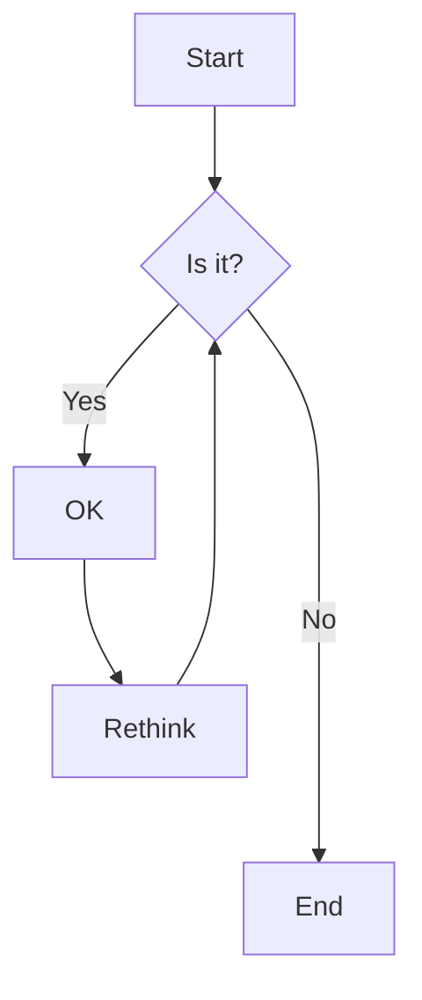

# Sample Markdown Rendering Test

This document contains various markdown elements to test rendering capabilities.

## Text Formatting

**Bold text** using double asterisks
__Bold text__ using double underscores

*Italic text* using single asterisks
_Italic text_ using single underscores

***Bold and italic*** using triple asterisks
___Bold and italic___ using triple underscores

~~Strikethrough text~~ using double tildes

## Code Elements

### Inline Code
Use `console.log("Hello, World!")` for inline code snippets.

### Code Blocks
```javascript
function greetUser(name) {
    const greeting = `Hello, ${name}!`;
    console.log(greeting);
    return greeting;
}

greetUser("Markdown Tester");
```

```python
def fibonacci(n):
    if n <= 1:
        return n
    return fibonacci(n-1) + fibonacci(n-2)

# Test the function
for i in range(10):
    print(f"F({i}) = {fibonacci(i)}")
```

```bash
#!/bin/bash
echo "Testing markdown rendering..."
ls -la
git status
```

## Lists

### Unordered Lists
- First item
- Second item
  - Nested item A
  - Nested item B
    - Deeply nested item
- Third item

### Ordered Lists
1. First step
2. Second step
   1. Sub-step 2.1
   2. Sub-step 2.2
3. Third step

### Mixed Lists
- Main bullet point
  1. Numbered sub-item
  2. Another numbered sub-item
- Another main bullet
  - Nested bullet
  - Another nested bullet

## Links and Images

### Links
[OpenAI](https://openai.com) - Regular link
[GitHub](https://github.com "GitHub Homepage") - Link with title
[Relative Link](./sample-markdown.md) - Relative link

### Reference-style Links
[Google][1] search engine
[Stack Overflow][stackoverflow] for questions

[1]: https://google.com
[stackoverflow]: https://stackoverflow.com

### Images


## Tables

| Feature | Supported | Notes |
|---------|-----------|--------|
| **Bold** | ✅ | Works everywhere |
| *Italics* | ✅ | Standard markdown |
| ~~Strikethrough~~ | ⚠️ | GitHub-flavored |
| `Code` | ✅ | Inline and blocks |
| Tables | ✅ | GitHub-flavored |
| [Links](https://example.com) | ✅ | Standard |

### Alignment Examples
| Left Aligned | Center Aligned | Right Aligned |
|:-------------|:--------------:|--------------:|
| Left text    | Center text    |        Right |
| A            | B              |              C |

## Blockquotes

> This is a simple blockquote.
> It can span multiple lines.

> **Nested blockquotes**
> > This is a nested blockquote
> > With more content
>
> Back to the first level

> ### Blockquotes with other elements
> 
> - Lists work in blockquotes
> - [Links too](https://example.com)
> 
> ```javascript
> const example = "This is in a blockquote";
> ```

## Horizontal Rules

Three hyphens:
---

Three asterisks:
***

Three underscores:
___

## Task Lists

### Simple Tasks
- [x] Completed task
- [ ] Incomplete task
- [ ] Another incomplete task

### Nested Tasks
- [x] Main project completed
  - [x] Sub-task 1 done
  - [x] Sub-task 2 done
  - [ ] Sub-task 3 pending
- [ ] Start new project

## Footnotes

Here's a sentence with a footnote[^1].

Another sentence with a longer explanation[^longnote].

[^1]: This is the first footnote.
[^longnote]: Here's a longer footnote that contains multiple paragraphs and even some `code`.

    You can have indented content in footnotes too.

## Definition Lists

Term 1
: Definition for term 1
: Another definition for term 1

Term 2 with *inline markup*
: Definition for term 2

        Additional paragraph in definition

## HTML Elements (where supported)

<div style="background-color: #f0f0f0; padding: 10px; border-radius: 5px;">
  <p><strong>Note:</strong> This section uses HTML for styling.</p>
</div>

<details>
<summary>Click to expand this section</summary>

### Hidden Content
This content is initially hidden and can be expanded by clicking.

```javascript
console.log("This code is in an expandable section");
```
</details>

## Mathematical Expressions (with MathJax/KaTeX)

### Inline Math
The quadratic formula is $x = \frac{-b \pm \sqrt{b^2-4ac}}{2a}$.

### Block Math
$$
\int_{-\infty}^{\infty} e^{-x^2} dx = \sqrt{\pi}
$$

## Emoji Support

Common emoji: 😀 😍 🎉 💡 🚀 ❤️

Using emoji codes: :smile: :heart: :thumbsup:

## Escaping Characters

\*This text is surrounded by literal asterisks\*

\`This is not code\`

\\This is a single backslash

## Line Breaks

This line ends with two spaces for a hard break.  
This appears on a new line.

This paragraph has a regular line break,
but it's just a soft break in most renderers.

## Extended Syntax Examples

### Mermaid Diagrams



### Syntax Highlighting with Line Numbers

```javascript {linenos=table,hl_lines=[2,5]}
function factorial(n) {
    if (n <= 1) return 1;
    return n * factorial(n - 1);
}

console.log(factorial(5)); // Output: 120
```

---

*This sample markdown document covers most common elements. Use it to test your markdown renderer's capabilities.*